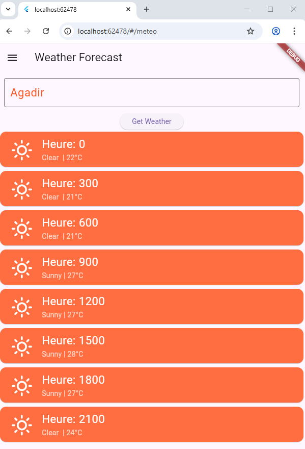

# 📱 Flutter Demo App 2 – BDCC Mobile UI Showcase

This is a Flutter-based mobile application developed as part of the BDCC (Big Data & Cloud Computing) curriculum. It demonstrates key Flutter concepts such as navigation drawer, responsive UI, API consumption (OpenWeather), contacts display, image grid, and dynamic counter.

---

## 🧩 Features

- 🚀 Navigation Drawer with smooth transitions
- 🔢 Counter Page (dynamic state)
- 📇 Contacts Page (mock contact list)
- ☁️ Meteo Page (OpenWeatherMap API)
- 🖼️ Gallery Page (image grid layout with local images)
- 📱 Compatible with emulator and real device

---

## 📸 Screenshots

<table>
  <tr>
    <td></td>
    <td></td>
    <td></td>
    <td></td>
   
  </tr>
  <tr>
    <td align="center"><b>Drawer Menu</b></td>
    <td align="center"><b>Counter</b></td>
    <td align="center"><b>Contacts</b></td>
    <td align="center"><b>Weather</b></td>
    <td align="center"><b>Gallery</b></td>
  </tr>
</table>

---

## 🛠️ How to Run

1. Clone the repo  
   ```bash
   git clone https://github.com/Mouhim202/Flutter-project-demo2.git
   cd Flutter_P2
   ```

2. Install dependencies  
   ```bash
   flutter pub get
   ```

3. Run the app  
   ```bash
   flutter run
   ```
